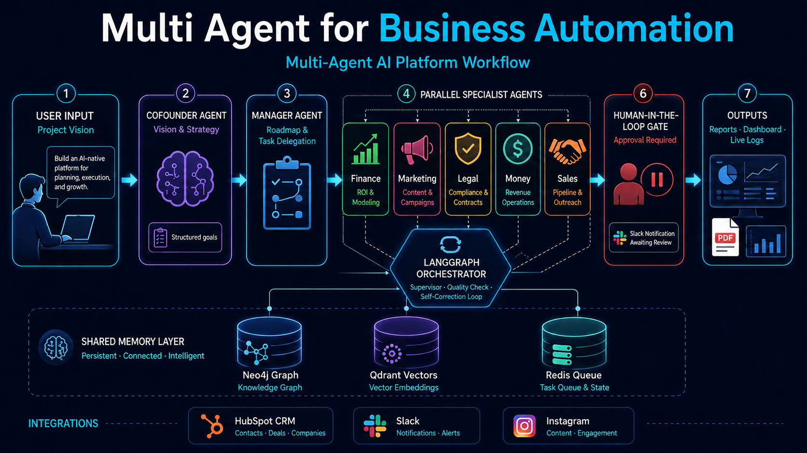

# Multi Agent for Business Automation

**Multi Agent for Business Automation** is a multi-agent orchestration platform for business automation and decision support. It coordinates specialized AI agents—each with distinct roles, personalities, and tools—through LangGraph workflows, shared memory, and human-in-the-loop (HITL) approval gates.

The system targets end-to-end business workflows: vision capture, planning, domain analysis (finance, marketing, legal), report generation, and optional integrations with CRM and social channels.



---

## Overview

| Layer | Description |
|-------|-------------|
| **Frontend** | React 18 + Vite dashboard with chat onboarding, agent status, task flow visualization, and PRD compliance views |
| **API** | FastAPI backend with REST endpoints, WebSocket streaming, and modular route controllers |
| **Orchestration** | LangGraph state machines with checkpointing, self-correction, and HITL interrupt nodes |
| **Agents** | Role-specific agents (Cofounder, Manager, Finance, Marketing, Legal, Money, Sales) backed by personality profiles |
| **Memory** | Neo4j graph memory, Qdrant vector search, Redis/Upstash task queues, and multi-level local caching |
| **Integrations** | HubSpot CRM, Slack notifications, Instagram marketing (with compliance engine) |

---


### Workflow model

1. **Vision intake** — The Cofounder agent captures and structures the user's project vision.
2. **Planning** — The Manager agent produces a roadmap and delegates tasks across domain agents.
3. **Domain execution** — Finance, Marketing, Legal, and other agents run in parallel or sequence as defined by the orchestrator.
4. **Quality & approval** — Confidence scoring and HITL checkpoints pause execution when human review is required.
5. **Output** — Results are persisted to shared memory, surfaced in the dashboard, and exported as HTML/PDF reports.

---

## Features

- **Specialized agents** with configurable personality profiles (temperature, confidence thresholds, role tools)
- **LangGraph orchestration** with state checkpointing, error recovery, and execution path tracking
- **Human-in-the-loop** approval flows with Slack notification hooks and timeout configuration
- **Unified memory** — graph relationships (Neo4j), semantic retrieval (Qdrant), and Redis-backed task queues with in-memory fallback
- **Real-time monitoring** — agent status, live logs, task flow visualization, and morning brief summaries
- **Report generation** — executive, marketing, financial, and comprehensive reports (JSON + PDF via WeasyPrint)
- **External integrations** — HubSpot CRM, Slack HITL channels, Instagram Business API with compliance checks
- **Demo mode** — local development without Supabase or external API keys (`DEMO_MODE=true`)

---

## Tech Stack

| Category | Technologies |
|----------|--------------|
| Backend | Python 3.9+, FastAPI, Uvicorn, Pydantic v2 |
| Agent framework | LangGraph, LangChain, CrewAI |
| LLM access | OpenRouter (primary), OpenAI, Google; mock provider for offline dev |
| Databases | Neo4j 5.x, Qdrant, Redis 7 / Upstash |
| Auth & persistence | Supabase (optional) |
| Frontend | React 18, Vite 5, React Router 6, Tailwind CSS, Recharts, React Flow |
| Tooling | Crawl4AI, Sentence Transformers, WeasyPrint, Matplotlib |

---

## Prerequisites

- **Python** 3.9 or later
- **Node.js** 18+ and **pnpm** (or npm)
- **Docker Desktop** (recommended for Neo4j, Qdrant, and Redis)
- At least one **LLM API key** (OpenRouter recommended) for non-mock inference

---

## Quick Start

### 1. Clone the repository

```bash
git clone https://github.com/luckup/agentflow.git
cd agentflow
```

### 2. Start infrastructure services

Docker Compose provisions Neo4j, Qdrant, and Redis locally:

```bash
docker compose up -d
```

Default Neo4j credentials in `docker-compose.yml`: `neo4j` / `agentflow123`.

### 3. Configure the backend

```bash
cd backend
cp .env.example .env
```

Edit `.env` with your keys. For local exploration, keep demo mode enabled:

```env
DEMO_MODE=true
OPENROUTER_API_KEY=your_key_here
NEO4J_URI=bolt://localhost:7687
NEO4J_USER=neo4j
NEO4J_PASSWORD=agentflow123
QDRANT_URL=http://localhost:6333
PORT=8000
```

For production-style integrations (Instagram, Slack, HubSpot, Upstash), see `backend/.env.prd.example`.

### 4. Install and run the backend

```bash
python -m venv venv

# Windows
venv\Scripts\activate

# macOS / Linux
source venv/bin/activate

pip install -r requirements.txt
python main.py
```

The API starts at **http://localhost:8000**. Open **http://localhost:8000/docs** for the interactive OpenAPI reference.

> **Note:** `backend/api/main.py` is a slimmer API entry point with a subset of routes. The full application surface is served by `backend/main.py`.

### 5. Install and run the frontend

In a separate terminal:

```bash
cd frontend
pnpm install
pnpm dev
```

The UI is available at **http://localhost:5173**. Vite proxies `/api` requests to the backend on port 8000.

---

## Configuration

| Variable | Purpose |
|----------|---------|
| `DEMO_MODE` | Bypass Supabase; use in-memory auth for local dev |
| `OPENROUTER_API_KEY` | Primary LLM provider |
| `OPENAI_API_KEY` / `GOOGLE_API_KEY` | Fallback LLM providers |
| `SUPABASE_URL` / `SUPABASE_KEY` | Production authentication |
| `NEO4J_URI` / `NEO4J_USER` / `NEO4J_PASSWORD` | Graph memory |
| `QDRANT_URL` / `QDRANT_API_KEY` | Vector memory |
| `REDIS_URL` / `UPSTASH_REDIS_REST_*` | Task queue and caching |
| `HUBSPOT_ACCESS_TOKEN` | CRM integration |
| `SLACK_BOT_TOKEN` | HITL and notification channels |
| `INSTAGRAM_ACCESS_TOKEN` | Marketing automation |

Memory and queue subsystems degrade gracefully when external services are unavailable—Redis falls back to an in-memory adapter, and LLM calls can use the mock provider.

---

## API Surface

Key endpoint groups (full list in `/docs`):

| Prefix | Description |
|--------|-------------|
| `/api/auth/*` | Sign up, sign in, user profile |
| `/api/projects`, `/api/start-project` | Project lifecycle |
| `/api/enhanced/*` | Session-based agent workflows with live logs |
| `/api/agents/*` | Agent listing and status |
| `/api/approvals/*` | Pending HITL approvals |
| `/api/conversation/*` | Direct agent chat |
| `/api/reports/*` | Report generation and PDF download |
| `/api/memory/*` | Graph export and memory statistics |
| `/api/analytics/*` | Predictions and analytics |
| `/api/integrations/*` | HubSpot, Slack, Instagram |
| `/api/prd/*` | PRD compliance checks |
| `/api/morning-brief/*` | Daily brief generation |
| `/api/shared-context/*` | Cross-agent shared context |
| WebSocket | Real-time agent logs and status streams |

---

## Agent Roster

Each agent is defined in `backend/agents/personalities.py` with traits, communication style, expertise areas, and role-specific tools.

| Agent | Focus |
|-------|-------|
| **Cofounder** | Vision, strategy, market opportunity |
| **Manager** | Roadmapping, task delegation, coordination |
| **Finance** | Financial modeling, ROI, budgeting |
| **Marketing** | Content strategy, brand, campaigns |
| **Legal** | Compliance, contracts, risk |
| **Money** | Revenue operations, pricing |
| **Sales** | Pipeline, outreach, forecasting |

The HITL orchestrator (`backend/workflows/hitl_langgraph_orchestrator.py`) maps PRD-aligned roles—Executive Advisor, Chief of Staff, Marketing Intelligence, Customer Success, Financial Operations, and Business Intelligence—to approval checkpoints.

---

## Project Structure

```
agentflow/
├── backend/
│   ├── main.py                 # Primary FastAPI application
│   ├── api/                    # Route controllers
│   ├── agents/                 # Agent implementations and personalities
│   ├── workflows/              # LangGraph and HITL orchestrators
│   ├── flows/                  # PRD DAG orchestrator
│   ├── memory/                 # Graph, vector, and cache managers
│   ├── task_queue/             # Redis/Upstash queue with fallback
│   ├── integrations/           # HubSpot, Slack, Instagram clients
│   ├── approvals/              # HITL approval managers
│   ├── collaboration/          # Cross-agent communication
│   ├── outputs/                # Report and document generation
│   ├── analytics/              # Predictions and metrics
│   ├── auth/                   # Supabase authentication
│   ├── services/               # LLM, agent, and report services
│   ├── tools/                  # Web search and dynamic tool registry
│   └── data/                   # Runtime data and conversation logs
├── frontend/
│   ├── src/
│   │   ├── App.jsx             # Auth-gated chat + dashboard shell
│   │   ├── pages/              # Workflow, analytics, monitoring views
│   │   ├── components/         # Dashboard, HITL, PRD, integration panels
│   │   └── services/api.js     # HTTP client with retry and caching
│   └── vite.config.js          # Dev server and API proxy
├── docker-compose.yml          # Neo4j, Qdrant, Redis
└── e2e_test.py                 # Playwright end-to-end test harness
```

---

## Development

### Verify database connectivity

```bash
cd backend
python test_db_connections.py
python test_redis.py
python test_shared_context_manager.py
```

### Run integration and auth tests

```bash
python test_auth.py
python test_integrations.py
python test_prd_compliance.py
```

### End-to-end UI test

Requires Playwright and both servers running:

```bash
pip install playwright
playwright install chromium
python e2e_test.py
```

### Frontend build

```bash
cd frontend
pnpm build
pnpm preview
```

---

## Design Principles

- **Graceful degradation** — External services (Redis, Qdrant, Neo4j, LLM providers) are optional at development time; fallbacks keep core flows runnable.
- **Structured coordination** — LangGraph state machines replace ad-hoc agent chaining for reproducible workflows.
- **Human oversight** — High-impact actions require explicit approval before execution.
- **Shared context** — Agents read and write to a unified memory layer rather than isolated conversation histories.

---

## License

License terms have not been specified in this repository. Contact the maintainers before redistribution or commercial use.
